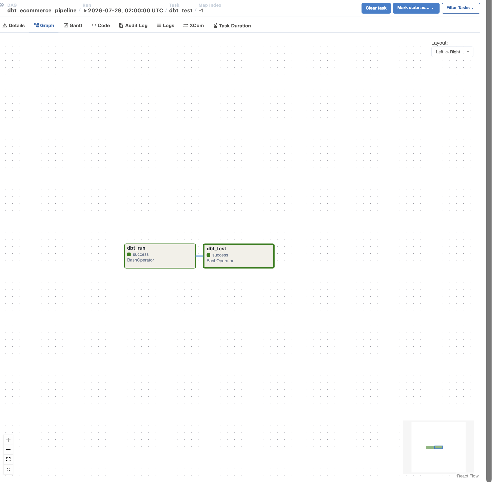
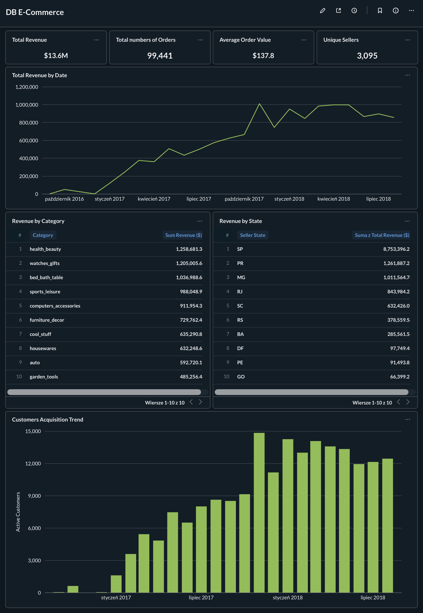

# E-commerce Analytics & Data Platform (Olist)

End-to-end data engineering and business intelligence project built on the public Brazilian E-Commerce dataset (Olist). The project covers the full lifecycle of data: from raw relational tables in a local data warehouse to transformation pipelines, automated testing, CI/CD, and final visualization dashboards.

## Architecture & Tech Stack

- Database / Data Warehouse: PostgreSQL (hosted locally via Docker)
- Transformation & Modeling: dbt (data build tool) following a structured multi-layer architecture (Staging -> Marts)
- Orchestration & Automation: Apache Airflow & Continuous Integration Pipeline (GitHub Actions)
- Business Intelligence & Dashboards: Metabase

## Project Structure

- ├── .github/workflows/       # Automated CIpipeline definitions
- ├── dags/                    # Apache Airflow DAGs for pipeline orchestration
- ├── analyses/                # Ad-hoc SQL queries and analytical scripts
- ├── models/                  # dbt models (Staging & Mart layers)
- │   ├── staging/             # Cleaned and renamed raw sources
- │   └── marts/               # Business-ready aggregates (Cohort analysis, Revenue, etc.)
- ├── tests/                   # Custom data tests and assertions
- ├── dbt_project.yml          # Main dbt project configuration
- └── README.md                # Project documentation

## Analytics & Dashboards (Metabase)

The project is integrated with Metabase to deliver key business insights through a cohesive dashboard:

- Executive KPIs: Total Revenue, Total Unique Customers, Total Orders, and Average Order Value.
- Revenue Trends: Macro-level growth analysis over time.
- Product & Regional Breakdown: Revenue performance by product categories and geographical states (seller_state).
- Customer Cohort & Retention Analysis: Tracking customer acquisition dynamics and long-term activity offsets (cohort_month & month_offset).

## CI/CD Pipeline (GitHub Actions)

To ensure code quality and data integrity, the repository features an automated CI/CD pipeline built with GitHub Actions.

Whenever code is pushed or a Pull Request is opened against the main branch, GitHub Actions automatically:

- Sets up a Python and dbt environment.
- Connects securely to the database using encrypted GitHub Secrets.
- Runs dbt test to validate data constraints (uniqueness, not-null, relationships) and model integrity.